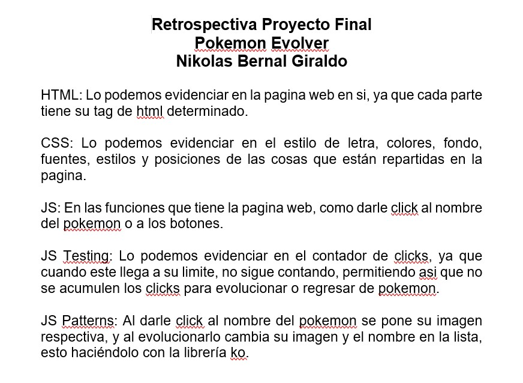
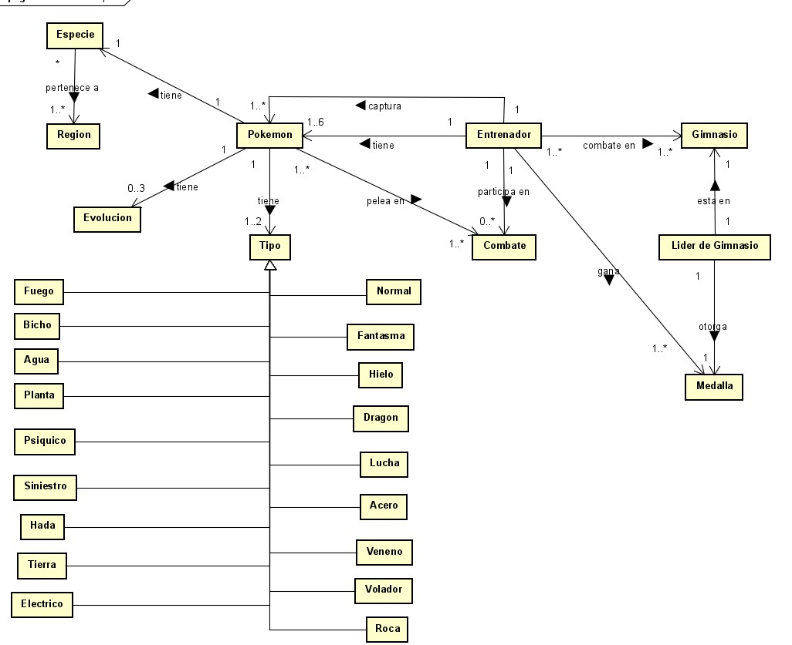
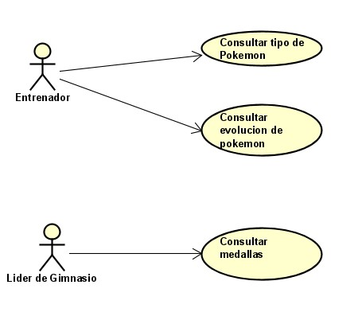

# Pokemon Evolver

Pokemon Evolver es el proyecto final realizado para el curso de Front End Developer ofrecido por Udacity, en el periodo intersemestral del año 2020.

La aplicación funciona gracias a la libreria knockout.js, y conocimientos sobre lenjuagues html y css.

En la aplicación se muestra una lista de los pokémon iniciales de todas las generaciones, mostrando su nombre, tipo, región y descripción, con la opción de evolucionarlos dandole click a un botón.

## Clonando Repositorio:

Nos ubicamos en la carpeta en la que queremos clonar el proyecto, en este caso Documents
```
$ cd Documents/
```

Clonamos el repositorio de gitHub:
```
$ git clone https://github.com/Nikolas2001-13/Proyecto-FrontEndDeveloper-Udacity
```

## Corriendo la Aplicación:

Nos dirigimos a la carpeta de Fuentes y ejecutamos el "index.html" en el navegador de preferencia.

## Interfaz de la Aplicación:


## Retrospectiva:



## Diagramas

### Diagrama de Conceptos:


### Diagrama de Casos de Uso:


## Autor

* **Nikolás Bernal Giraldo** - [Nikolas2001-13](https://github.com/Nikolas2001-13) - Estudiante de la Escuela Colombiana de Ingeniería Julio Gravito

## Licencia

[LICENSE.md](http://www.gnu.org/licenses/gpl.html)